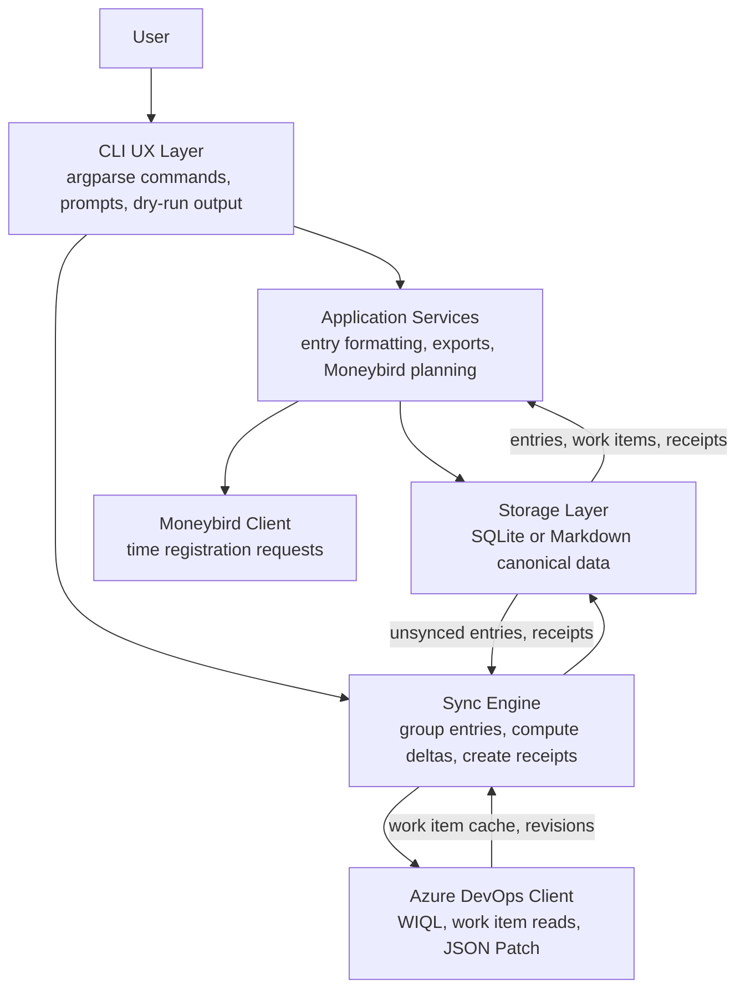
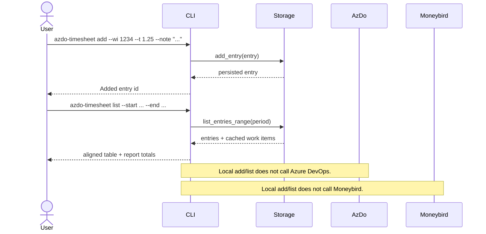
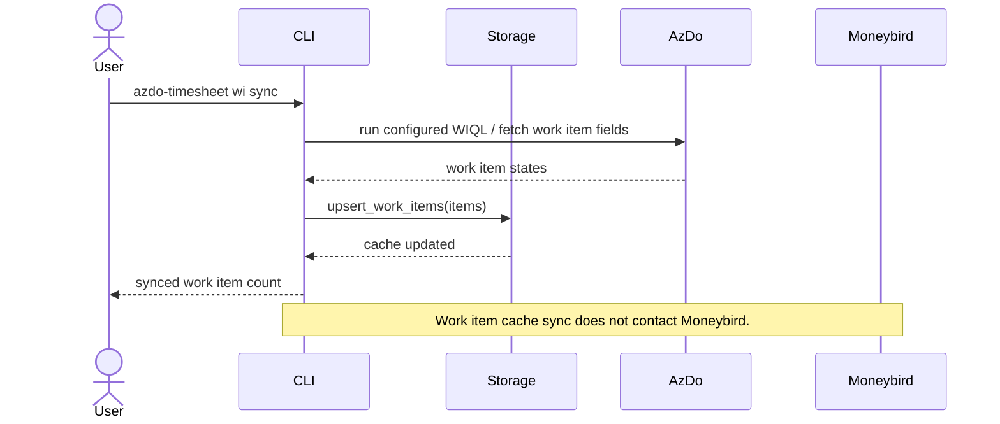
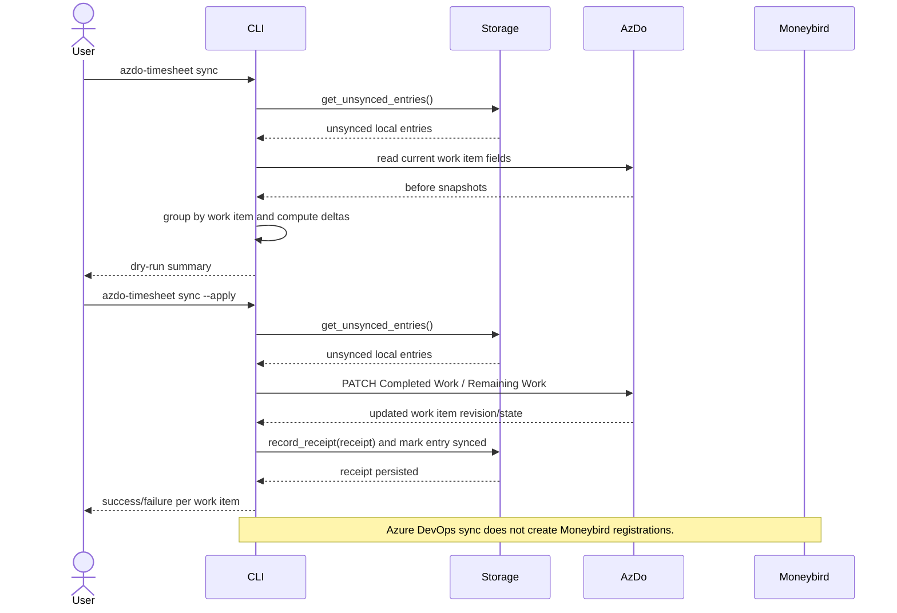
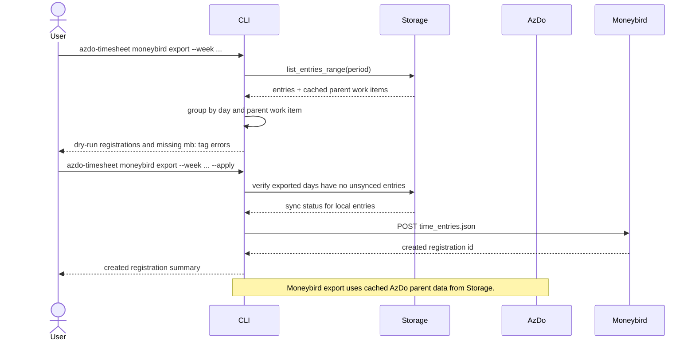

# Architecture Overview

Azure DevOps Timesheet is a CLI-first local timesheet. The detailed local
timesheet is the source of truth; Azure DevOps and Moneybird are downstream
systems updated from local entries.

## Layer Model

### Layer Responsibilities

| Layer | Responsibilities |
| --- | --- |
| CLI UX Layer | Parse commands, keep entry logging fast, print trustable dry-run and list output. |
| Application Services | Format reports, plan CSV/JSON and Moneybird exports, apply report-hour rounding. |
| Sync Engine | Group unsynced entries by work item, compute Completed Work deltas, apply Remaining Work strategy, save receipts after successful sync. |
| Storage Layer | Persist entries, cached work items, and receipts. SQLite and Markdown backends expose the same storage behavior. |
| Azure DevOps Client | Read work items through WIQL/API calls and apply JSON Patch updates. |
| Moneybird Client | Create time registrations from locally planned day and parent-work-item totals. |

## Data Ownership

Local storage owns detailed time entry data. Azure DevOps owns work item fields
such as title, state, Completed Work, Original Estimate, and Remaining Work.
Moneybird owns created time registrations. Receipts connect local entries to the
Azure DevOps patch that applied them, which keeps sync idempotent.

Human-facing reports round each entry to the nearest quarter hour before
summing. Canonical entry data keeps the exact stored `hours` value so exports
and sync receipts can preserve the original input.

## Add And List Entries

## Work Item Cache Sync

## Azure DevOps Time Sync

## Moneybird Export

## Safety Invariants

- Entry logging must stay local and fast.
- Dry-run output must describe planned changes before external writes.
- Azure DevOps sync must record receipts only after a successful patch.
- Synced entries must not be applied to Azure DevOps a second time.
- Moneybird apply requires the exported local days to be synced to Azure DevOps first.
